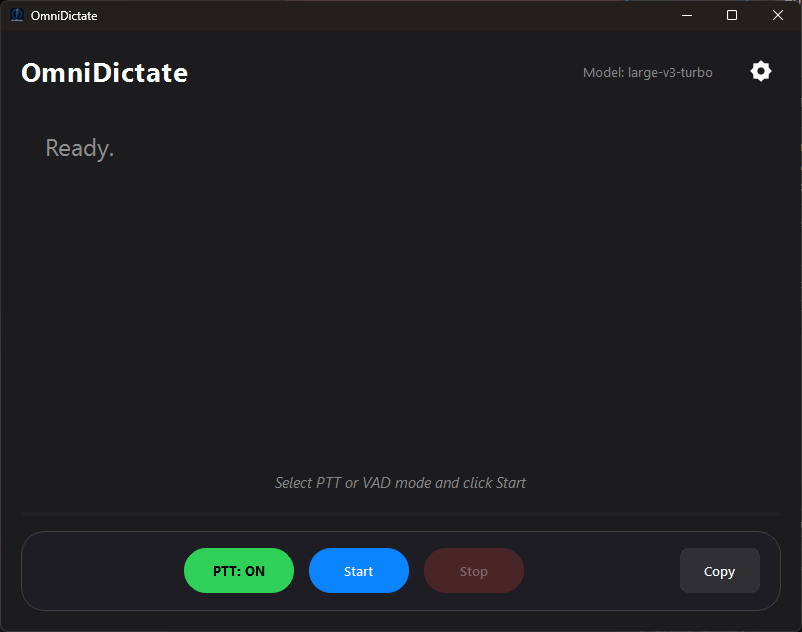

# OmniDictate: Real-time AI Dictation GUI for Windows 

[](https://creativecommons.org/licenses/by-nc/4.0/)

**Summary:** Free, open-source, real-time dictation for Windows. Runs locally (no cloud!), uses AI (`faster-whisper`), and types directly into any application via a user-friendly GUI.



OmniDictate provides a modern desktop application for real-time speech-to-text on your Windows PC. It utilizes the optimized `faster-whisper` library (based on OpenAI's Whisper) for accurate transcription directly on your machine, ensuring privacy and offline capability. Text is typed directly into your active window.

*Looking for the original command-line version? Find it here: [OmniDictate-CLI Repository](https://github.com/gurjar1/OmniDictate-CLI)*

## Demo

https://github.com/user-attachments/assets/995a582a-e641-4aa5-bc52-0cc59f5a1777

## Features

*   **Premium Slate & Glass UI (v2.0):** A stunning, modern interface featuring a dark slate theme with frosted glass accents, designed for clarity and focus.
*   **Whisper Ultra Support:** Now supports the **`large-v3-turbo`** model for state-of-the-art accuracy with improved speed.
*   **Streamlined Controls:** Simplified experience with unified VAD/PTT toggle and removal of complex stop hotkeys.
*   **Real-time Transcription:** Converts speech to text with low latency.
*   **Local & Private:** All processing happens on your machine; no cloud required.
*   **Type Anywhere:** Simulates keyboard input into virtually any active Windows application (except OmniDictate itself).
*   **Configurable Settings:** Adjust model size, language (Auto-Detect or specific), VAD sensitivity, typing delay, hotkeys, and more via the interface. Settings are saved automatically.
*   **Voice Activity Detection (VAD):** Toggle automatic start/stop based on speech via a GUI button.
*   **Push-to-Talk (PTT):** Use a configurable global hotkey (Default: Right Shift) for manual control.
*   **Voice Commands:**
    *   "delete last *n* words"
    *   Spoken Punctuation (e.g., "comma", "period").
*   **Hallucination Filtering:** Add/Remove specific repetitive phrases to filter from the output via the GUI.
*   **Transcription Display:** View the transcribed text within the application.
*   **Copy Functionality:** Easily copy the displayed transcription using a button.
*   **Restore Defaults:** Reset all configurable settings to their original values.

## System Requirements

Before installing, ensure your system meets these requirements.

### Hardware
*   **Operating System:** Windows 10 or 11 (64-bit).
*   **Processor:** Intel Core i5 or equivalent (quad-core+).
*   **RAM:** 8GB (16GB+ recommended).
*   **Storage:** Space for the Whisper model.
*   **GPU (Highly Recommended):** NVIDIA GPU with CUDA support (4GB+ VRAM, 6GB+ for larger models) for acceptable performance. CPU mode is supported but significantly slower.

### Software & Drivers
*   **Microsoft Visual C++ Redistributable:** **REQUIRED** for both CPU and GPU usage.
    *   [**Download Visual Studio 2015-2022 Redistributable (x64)**](https://aka.ms/vs/17/release/vc_redist.x64.exe)
*   **NVIDIA Users (Critical):** If you intend to use GPU acceleration, you **MUST** install the following *before* running the application:
    1.  **NVIDIA Driver:** [Download Latest Driver](https://www.nvidia.com/Download/index.aspx)
    2.  **CUDA Toolkit 12.6:** [Download from NVIDIA Archive](https://developer.nvidia.com/cuda-12-6-0-download-archive)
    3.  **Verify:** Ensure `nvcc --version` works in your terminal.

## Installation & Downloads

**Important Considerations:**
*   **Large File Size:** Includes Python runtime and AI models.
*   **Unsigned Application:** You may see a Windows SmartScreen warning ("Windows protected your PC"). Click **"More info" -> "Run anyway"** to proceed.

### A. Using the Installer (`.exe`) - Recommended
1.  **Prerequisites:** Ensure you have installed the items listed in [System Requirements](#system-requirements).
2.  **Download:** Go to the [**Releases Page**](https://github.com/gurjar1/OmniDictate/releases) and download the latest `OmniDictate_Setup_vX.Y.Z.exe`.
3.  **Run Installer:** Double-click the `.exe`. Accept the SmartScreen warning. Follow the prompts.
4.  **Launch:** Use the Start Menu or Desktop shortcut.

### B. Using the Portable ZIP (`.7z` Archive)
1.  **Prerequisites:** Ensure you have installed the items listed in [System Requirements](#system-requirements).
2.  **Download:** Go to the [**Releases Page**](https://github.com/gurjar1/OmniDictate/releases) and download `OmniDictate_Portable_vX.Y.Z.7z`.
3.  **Extract:** Use [7-Zip](https://www.7-zip.org/) to extract the archive to a folder of your choice.
4.  **Run:** Open the extracted folder and double-click `OmniDictate.exe`.

## Usage Guide

1.  **Launch OmniDictate.**
2.  **Configure (Optional):** Adjust settings in the "Configuration" section. Settings save automatically.
3.  **Start Dictation:** Click the "Start Dictation" button. The status will update.
4.  **Dictate:**
    *   **VAD Mode (Default):** Simply speak when the status is "Listening". Transcription starts automatically. Pause speaking to stop recording.
    *   **Push-to-Talk (PTT):** Hold down the configured PTT key (Default: Right Shift). Transcription occurs only while the key is held. This overrides VAD. (Toggle VAD off using the button if you *only* want PTT).
    *   **Output:** Text appears in the active application window (unless it's OmniDictate) and in the "Transcription Output" area in the GUI.
5.  **Use Commands:** Say "comma", "at", "open bracket", etc., during dictation.
6.  **Stop Dictation:** Click the "Stop" button.

## Configuration via GUI

*   **Model:** Select Whisper model size (including `large-v3-turbo`).
*   **Language:** Supports **Auto Detection** and multiple languages (English, Spanish, French, German, etc.).
*   **VAD Toggle:** Enable/disable Voice Activity Detection.
*   **Silence Threshold:** VAD sensitivity (lower = more sensitive).
*   **Typing Delay:** Time (seconds) between typed characters.
*   **PTT Hotkey:** Click "Set" and press the desired key.
*   **Filter Words:** Add/Remove exact phrases to ignore.
*   **Restore Defaults:** Reset all settings.

## Troubleshooting

*   **`CUDA is not available` / Slow Performance:** Verify GPU, NVIDIA Driver, *matching* CUDA Toolkit/cuDNN installation, and CUDA-enabled PyTorch installation. Check PATH variables.
*   **`Failed to load Python DLL...` (when running .exe):** Ensure **Microsoft Visual C++ Redistributable (VS 2015-2022 x64)** is installed.
*   **Garbled Typing:** Increase the "Typing Delay" setting. Test in Notepad first.
*   **No Audio/VAD Not Working:** Check default microphone in Windows Sound settings (ensure 16000 Hz, not exclusive mode). Adjust "Silence Threshold".
*   **`ModuleNotFoundError`:** Activate virtual environment and run `pip install -r requirements.txt`.
*   **Hotkey Issues:** Ensure no other app uses the same global hotkeys. Restart the app after changing keys.

## Tested Versions (v2.0.0 Build)

The pre-built application was compiled with the following versions. If you are building from source or troubleshooting GPU issues, aim for these:

| Component | Version | Notes |
| :--- | :--- | :--- |
| **Python** | 3.11.9 | [Download](https://www.python.org/downloads/release/python-3119/) |
| **PyTorch** | 2.6.0+cu126 | [Get Started](https://pytorch.org/get-started/locally/) or (pip install torch==2.6.0 torchvision==0.21.0 torchaudio==2.6.0 --index-url https://download.pytorch.org/whl/cu126) |
| **CUDA Toolkit** | 12.6 | [Download](https://developer.nvidia.com/cuda-12-6-0-download-archive) |
| **faster-whisper** | 1.1.1 | [Source](https://github.com/SYSTRAN/faster-whisper/releases) |
| **ctranslate2** | 4.5.0 | [Source](https://github.com/OpenNMT/CTranslate2/releases) |

## Building from Source (Optional)

If you prefer to build from source:

1.  **Install Python 3.11.9** and **Git**.
2.  **Clone Repo:** `git clone https://github.com/gurjar1/OmniDictate.git && cd OmniDictate`
3.  **Create & Activate Venv:** `python -m venv venv` and activate it.
4.  **Install PyTorch (CUDA Version):**
    ```bash
    pip install torch torchvision torchaudio --index-url https://download.pytorch.org/whl/cu126
    ```
5.  **Install Other Dependencies:** `pip install -r requirements.txt`
6.  **Run:** `python main_gui.py`

## License

This project is licensed under the [Creative Commons Attribution-NonCommercial 4.0 International License](https://creativecommons.org/licenses/by-nc/4.0/).

*   ✅ Free for personal/non-commercial use.
*   🚫 Commercial use requires explicit permission.

(See the `LICENSE` file for full details).

Copyright (c) 2025 Kapil Gurjar
