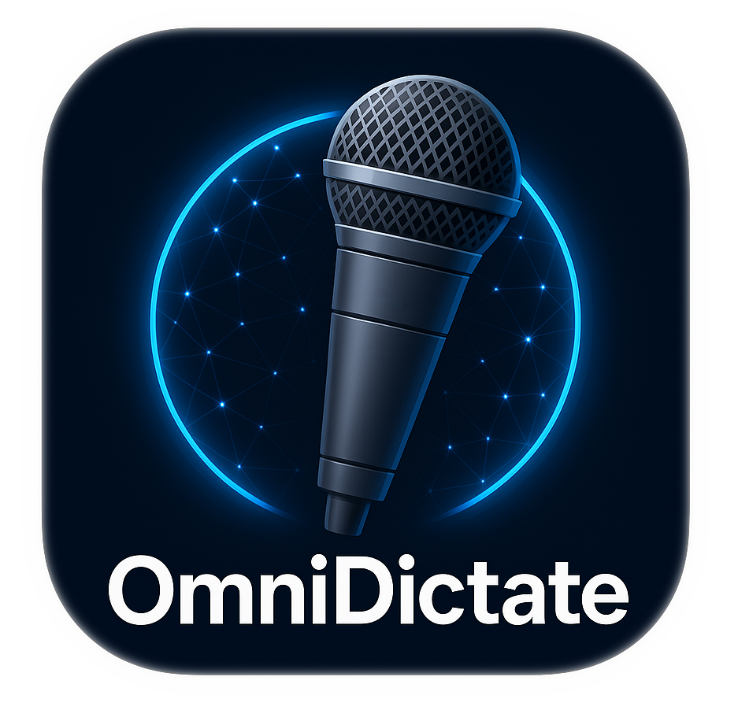
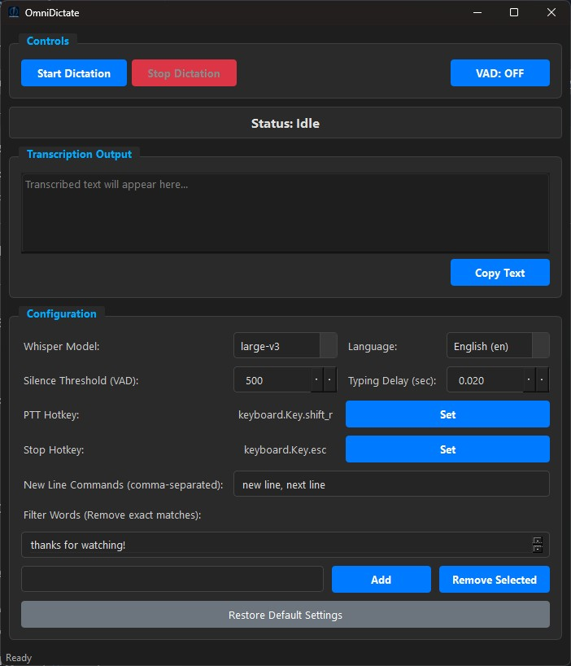

# OmniDictate: Real-time AI Dictation GUI for Windows 

**Repository:** [https://github.com/gurjar1/OmniDictate](https://github.com/gurjar1/OmniDictate)

**Summary:** Free, open-source, real-time dictation for Windows. Runs locally (no cloud!), uses AI (`faster-whisper`), and types directly into any application via a user-friendly GUI.

OmniDictate provides a modern desktop application for real-time speech-to-text on your Windows PC. It utilizes the optimized `faster-whisper` library (based on OpenAI's Whisper) for accurate transcription directly on your machine, ensuring privacy and offline capability. Text is typed directly into your active window.

*Looking for the original command-line version? Find it here: [OmniDictate-CLI Repository](https://github.com/gurjar1/OmniDictate-CLI)*

## Downloads & Installation Notes

Pre-built versions for Windows are available below.

**Important Considerations:**

*   **Large File Size:** The application includes the Python runtime and necessary AI model libraries (like PyTorch CPU), resulting in a large download size.
*   **Unsigned Application:** As this is a free, open-source project, the executable and installer are **not digitally signed** with an expensive code signing certificate. This means Windows Defender SmartScreen or your antivirus might show a warning ("Windows protected your PC" or similar) when you run the installer or executable for the first time. You may need to click "More info" and then "Run anyway" to proceed.
*   **Prerequisites:** Ensure you have installed the **Microsoft Visual C++ Redistributable (VS 2015-2022 x64)** before running either version. GPU users also need the correct NVIDIA components (see Requirements section).

**Download Options:**

1.  **Installer (`.exe` - Recommended):** Installs to Program Files and creates shortcuts. Easier for most users. Download from the [**Releases Page**](https://github.com/gurjar1/OmniDictate/releases). *(You can attach the smaller setup.exe directly to the GitHub release).*
2.  **Portable ZIP (`.zip`):** No installation needed. Extract the folder and run `OmniDictate.exe` from inside. Useful if you prefer portable apps or encounter installer issues.
    *   **Download Link (Google Drive due to GitHub size limits):**
        [**OmniDictate_v1.0.0_Windows_x64.zip**](https://drive.google.com/file/d/1XAcbFmybJ_XVJNuF4MAk2Kg0oYcE9EnD/view?usp=drive_link)

## Features

*   **Modern GUI:** User-friendly interface built with PySide6, featuring a dark theme.
*   **Real-time Transcription:** Converts speech to text with low latency.
*   **Local & Private:** All processing happens on your machine; no cloud required.
*   **Type Anywhere:** Simulates keyboard input into virtually any active Windows application (except OmniDictate itself).
*   **Configurable Settings:** Adjust model size, language (English only currently enabled), VAD sensitivity, typing delay, hotkeys, and more via the interface. Settings are saved automatically.
*   **Voice Activity Detection (VAD):** Toggle automatic start/stop based on speech via a GUI button.
*   **Push-to-Talk (PTT):** Use a configurable global hotkey (Default: Right Shift) for manual control.
*   **Global Stop Hotkey:** Stop dictation from anywhere (Default: Escape). Configurable via GUI.
*   **Voice Commands:**
    *   "delete last *n* words"
    *   "new line" / "next line" (configurable)
    *   Spoken Punctuation (e.g., "comma", "period").
*   **Hallucination Filtering:** Add/Remove specific repetitive phrases to filter from the output via the GUI.
*   **Transcription Display:** View the transcribed text within the application.
*   **Copy Functionality:** Easily copy the displayed transcription using a button.
*   **Restore Defaults:** Reset all configurable settings to their original values.

## Requirements

*   **Operating System:** Windows 10 or 11 (64-bit recommended).
*   **NVIDIA GPU (Highly Recommended):** CUDA-enabled GPU (4GB+ VRAM, 6GB+ for larger models) for acceptable performance. CPU mode is supported but significantly slower.
*   **CUDA Toolkit & cuDNN (CRITICAL for GPU):** Must be installed correctly *before* installing PyTorch if building from source, or before running the packaged application if using GPU mode. See detailed instructions below.
*   **Microsoft Visual C++ Redistributable:** Required on machines where the application will run. Download and install the "Visual Studio 2015-2022 Redistributable (x64)" from Microsoft's website.

## Installation & Setup (Detailed)

*(Choose Installer or Portable ZIP from the [Downloads](#downloads--installation-notes) section above)*

**A. Using the Installer (`.exe`)**

1.  **Install Prerequisites:**
    *   Install the **Microsoft Visual C++ Redistributable (VS 2015-2022 x64)**.
    *   **If using GPU:** Ensure NVIDIA Driver, CUDA Toolkit, and cuDNN are installed (see "CUDA/cuDNN Setup" below).
2.  **Download:** Go to the [**Releases Page**](https://github.com/gurjar1/OmniDictate/releases) and download the latest `OmniDictate_Setup_vX.Y.Z.exe` file.
3.  **Run Installer:** Double-click `OmniDictate_Setup_*.exe`. You may see a Windows SmartScreen warning because the app is unsigned; click "More info" -> "Run anyway". Follow the installation prompts (Admin privileges required).
4.  **Launch:** Use the Start Menu or Desktop shortcut.

**B. Using the Portable ZIP (`.zip`)**

1.  **Install Prerequisites:**
    *   Install the **Microsoft Visual C++ Redistributable (VS 2015-2022 x64)**.
    *   **If using GPU:** Ensure NVIDIA Driver, CUDA Toolkit, and cuDNN are installed (see "CUDA/cuDNN Setup" below).
2.  **Download Link (Google Drive due to GitHub size limits):**
        [**OmniDictate_v1.0.0_Windows_x64.zip**](https://drive.google.com/file/d/1XAcbFmybJ_XVJNuF4MAk2Kg0oYcE9EnD/view?usp=drive_link)
3.  **Extract:** No installation needed. Extract the downloaded file to a location of your choice (e.g., `C:\Users\yourusername\Downloads\OmniDictate`). Useful if you prefer portable apps or encounter installer issues.
4.  **Run:** Open the extracted `OmniDictate` folder and double-click `OmniDictate.exe`. You might see a Windows SmartScreen warning on first run; click "More info" -> "Run anyway".

**C. CUDA/cuDNN Setup for GPU Users (CRITICAL)**

*This must be done *before* installing PyTorch if building from source, or before running the packaged `.exe` if using GPU mode.*

1.  **NVIDIA Driver:** Install the latest driver for your GPU.
2.  **Determine Required CUDA Version:** Check the PyTorch website ([https://pytorch.org/get-started/locally/](https://pytorch.org/get-started/locally/)) for the CUDA version compatible with the PyTorch version used (check `requirements.txt` if building).
3.  **Download CUDA Toolkit:** Download the *matching* version from [NVIDIA CUDA Toolkit Archive](https://developer.nvidia.com/cuda-toolkit-archive).
4.  **Install CUDA Toolkit:** Run installer (Custom > Select "CUDA" components).
5.  **cuDNN:** Usually included with the CUDA Toolkit installer. Separate download/install typically *not* needed.
6.  **Verify PATH:** Ensure CUDA `bin` and `libnvvp` directories are in your system PATH. Verify by running `nvcc --version` in a *new* terminal.

**(Optional) Building from Source:**

If you prefer to build from source instead of using the pre-built releases:

1.  **Install Python:** (See Requirements)
2.  **Install Git:** (See Requirements)
3.  **Install CUDA/cuDNN:** (See steps above)
4.  **Clone Repo:** `git clone https://github.com/gurjar1/OmniDictate.git && cd OmniDictate`
5.  **Create & Activate Venv:** `python -m venv venv && .\venv\Scripts\Activate.ps1`
6.  **Install PyTorch (CUDA Version):** Get the *exact* command for your CUDA version from [PyTorch website](https://pytorch.org/get-started/locally/) and run it.
7.  **Install Other Dependencies:** `pip install -r requirements.txt`
8.  **Run:** `python main_gui.py`

## Usage Guide

1.  **Launch OmniDictate.**
2.  **Configure (Optional):** Adjust settings in the "Configuration" section. Settings save automatically.
3.  **Start Dictation:** Click the "Start Dictation" button. The status will update.
4.  **Dictate:**
    *   **VAD Mode (Default):** Simply speak when the status is "Listening". Transcription starts automatically. Pause speaking to stop recording.
    *   **Push-to-Talk (PTT):** Hold down the configured PTT key (Default: Right Shift). Transcription occurs only while the key is held. This overrides VAD. (Toggle VAD off using the button if you *only* want PTT).
    *   **Output:** Text appears in the active application window (unless it's OmniDictate) and in the "Transcription Output" area in the GUI.
5.  **Use Commands:** Say "delete last two words", "new line", "comma", etc., during dictation.
6.  **Stop Dictation:** Click the "Stop Dictation" button or press the configured Stop hotkey (Default: Escape).

## Configuration via GUI

*   **Model:** Select Whisper model size.
*   **Language:** Currently locked to English (`en`).
*   **VAD Toggle:** Enable/disable Voice Activity Detection.
*   **Silence Threshold:** VAD sensitivity (lower = more sensitive).
*   **Typing Delay:** Time (seconds) between typed characters.
*   **Hotkeys (PTT/Stop):** Click "Set" and press the desired key.
*   **New Line Commands:** Edit comma-separated phrases.
*   **Filter Words:** Add/Remove exact phrases to ignore.
*   **Restore Defaults:** Reset all settings.

## Supported Punctuation

"question mark", "exclamation mark", "comma", "period" / "full stop", "colon", "semicolon", "open parenthesis", "close parenthesis", "open bracket", "close bracket", "open brace", "close brace", "hyphen" / "dash", "underscore", "plus", "equals", "at", "hash", "dollar", "percent", "caret", "ampersand", "asterisk".

## Troubleshooting

*   **`CUDA is not available` / Slow Performance:** Verify GPU, NVIDIA Driver, *matching* CUDA Toolkit/cuDNN installation, and CUDA-enabled PyTorch installation (if building from source, ensure it's in the venv). Check PATH variables. Ensure you selected the GPU version during PyTorch install. Try a smaller model size.
*   **`Failed to load Python DLL...` (when running .exe):** Ensure **Microsoft Visual C++ Redistributable (VS 2015-2022 x64)** is installed on the target machine. If building yourself, ensure the `.exe` was built from the activated virtual environment.
*   **Garbled Typing:** Increase the "Typing Delay" setting. Test in Notepad first.
*   **No Audio/VAD Not Working:** Check default microphone in Windows Sound settings (ensure 16000 Hz, not exclusive mode). Adjust "Silence Threshold". Check ASIO4ALL config if used.
*   **`ModuleNotFoundError`:** Activate virtual environment and run `pip install -r requirements.txt`.
*   **Hotkey Issues:** Ensure no other app uses the same global hotkeys. Restart the app after changing keys to ensure the listener updates.
*   **COM Error:** Ensure `pywin32` is correctly installed (`pip install -r requirements.txt`).

## Minimum System Requirements

*   **OS:** Windows 10 or 11 (64-bit)
*   **Processor:** Intel Core i5 or equivalent (quad-core+)
*   **RAM:** 8GB (16GB+ recommended)
*   **GPU (Recommended):** NVIDIA GPU with CUDA support (4GB+ VRAM, 6GB+ for larger models)
*   **Storage:** Space for the Whisper model.

## License

This project is licensed under the [Creative Commons Attribution-NonCommercial 4.0 International License](https://creativecommons.org/licenses/by-nc/4.0/).

*   ✅ Free for personal/non-commercial use.
*   🚫 Commercial use requires explicit permission.

(See the `LICENSE` file for full details).

Copyright (c) 2023 Kapil Gurjar
