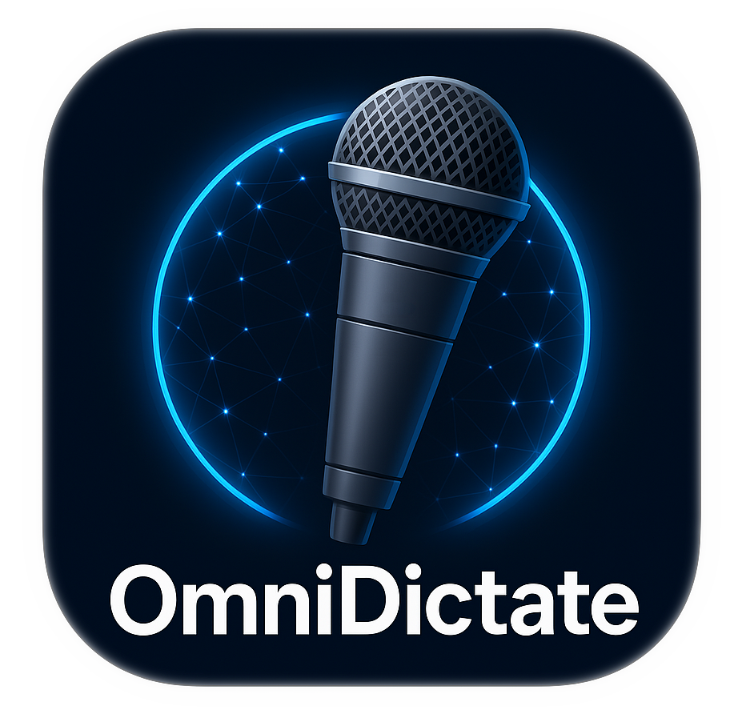
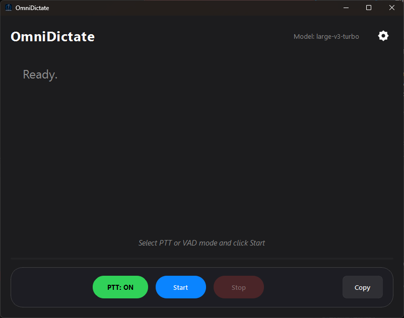

# OmniDictate: Local Dictation for Windows 

[](https://creativecommons.org/licenses/by-nc/4.0/)
[](https://deepwiki.com/gurjar1/OmniDictate)

OmniDictate is a Windows dictation app that runs speech-to-text locally on your computer. Speak into your microphone, and OmniDictate can type the transcript into the active app or keep the transcript inside OmniDictate.



Looking for the original command-line version? See [OmniDictate-CLI](https://github.com/gurjar1/OmniDictate-CLI).

## Demo

https://github.com/user-attachments/assets/995a582a-e641-4aa5-bc52-0cc59f5a1777

## Download And Install

1. Open the [GitHub Releases page](https://github.com/gurjar1/OmniDictate/releases).
2. Download the latest `OmniDictate_Setup_vX.Y.Z.exe`.
3. Run the installer.
4. Start OmniDictate from the Start Menu or Desktop shortcut.
5. Allow microphone permission if Windows asks.

The installer uses per-user installation under `%LOCALAPPDATA%\OmniDictate`, so it should not require administrator access.

The app is currently unsigned, so Windows SmartScreen may show a warning. Only continue if the installer came from the official GitHub Releases page.

## Fresh Windows Requirements

The installer includes OmniDictate and its app runtime. A fresh Windows machine may still need:

- Windows 10 or Windows 11, 64-bit.
- A working microphone.
- Internet access on first use so the selected Whisper model can download.
- For GPU acceleration: an NVIDIA GPU plus a working NVIDIA driver and CUDA/cuDNN runtime that matches this OmniDictate build. CPU mode can work, but it is much slower.
- Microsoft Visual C++ Redistributable 2015-2022 x64 if Windows reports missing runtime DLLs.

You do not need to install Python, Git, or PyTorch to use the normal installer.

Recommended runtime setup:

OmniDictate shows a **Runtime** badge in the main window after the speech model starts. Click it to open **Performance Check**. The checker says whether the app is using GPU or CPU mode, what was detected, and which setup step to try next.

Use these official downloads only when Performance Check says GPU setup needs attention:

1. Install or update your NVIDIA display driver from [NVIDIA Driver Downloads](https://www.nvidia.com/en-us/drivers/).
2. Install the CUDA runtime/toolkit version recommended by Performance Check from the [CUDA Toolkit Archive](https://developer.nvidia.com/cuda-toolkit-archive).
3. If OmniDictate reports missing cuDNN DLLs or GPU loading still fails, install the cuDNN version recommended by Performance Check from the [NVIDIA cuDNN Archive](https://developer.nvidia.com/rdp/cudnn-archive).
4. If Windows reports missing Visual C++ runtime DLLs, install **Microsoft Visual C++ Redistributable for Visual Studio 2015-2022 x64** from [Microsoft's latest supported VC++ Redistributable page](https://learn.microsoft.com/en-us/cpp/windows/latest-supported-vc-redist). The direct x64 installer is [vc_redist.x64.exe](https://aka.ms/vs/17/release/vc_redist.x64.exe).

## Why The Installer Is Smaller Now

The installer includes the app, Python runtime, desktop UI runtime, and speech-to-text runtime support. It does not include downloaded Whisper model files, NVIDIA driver files, or local test data.

Whisper models are downloaded on demand the first time you use a selected model. This keeps the installer smaller and lets you choose the model size that fits your computer.

## Updating

To update manually:

1. Open the [GitHub Releases page](https://github.com/gurjar1/OmniDictate/releases).
2. Download the newest installer.
3. Run it normally.

OmniDictate also has a Settings button named **Check for Updates**. It checks GitHub Releases only when you click it. If a newer version is available, OmniDictate can open the release page for you.

## Uninstalling

You can uninstall OmniDictate from Windows **Settings > Apps > Installed apps**.

If you installed with the default per-user installer, you can also run:

```text
%LOCALAPPDATA%\OmniDictate\unins000.exe
```

The uninstaller removes the installed app files. Downloaded model caches may remain in the normal Hugging Face cache folder so models do not need to download again if you reinstall.

## Features

- Local speech-to-text with Whisper.
- Model selection, including `large-v3-turbo`.
- Voice Activity Detection (VAD).
- Push-to-Talk (PTT).
- Optional typing into the active Windows app.
- Transcribe Only mode for keeping text inside OmniDictate without keyboard simulation.
- Preferred language selection, including Auto Detect and Czech.
- Minimum PTT hold time to ignore accidental taps.
- Spoken punctuation such as "comma" and "period".
- Blocked phrases for repeated unwanted phrases.
- Copy button for the current transcript.

## Usage

1. Launch OmniDictate.
2. Choose a model and language in Settings if needed.
3. Choose VAD or PTT mode.
4. Click **Start**.
5. Speak clearly.
6. Click **Stop** when finished.

If **Type into active app** is on, OmniDictate types into the frontmost app. If it is off, OmniDictate only shows the transcript in its own window.

If OmniDictate itself is the active window, it keeps the transcript inside OmniDictate and does not replay old text into the next app you click.

## Settings

- **Whisper model:** Smaller models are faster. Larger models can be more accurate.
- **Preferred language:** Use Auto Detect or choose a fixed language.
- **Silence sensitivity:** Lower values trigger recording more easily.
- **Typing pace:** Slow this down if another app drops letters.
- **Typing output:** Turn off active-app typing for Transcribe Only mode.
- **Minimum PTT hold:** Ignore very short accidental PTT key taps.
- **Push-to-talk key:** Choose the key used for PTT mode.
- **Blocked phrases:** Remove exact repeated phrases from the final output.
- **Check for Updates:** Look for a newer release on GitHub.
- **Restore Defaults:** Reset settings to the default setup.

## Troubleshooting

- **Slow transcription or low GPU usage:** click the **Runtime** badge and open **Performance Check**. If it says CPU mode, follow the listed NVIDIA driver, CUDA, and cuDNN steps. CPU fallback can be much slower.
- **First run takes time:** the selected Whisper model may be downloading.
- **Repeated phrases such as "thank you" or "I'm sorry":** try a larger model, reduce background noise, increase the minimum PTT hold, or add the exact phrase to Blocked phrases.
- **Garbled typing:** increase Typing pace and test in Notepad first.
- **No microphone input:** check Windows microphone permission, default input device, and exclusive-mode settings.
- **Failed to load Python DLL:** install the Microsoft Visual C++ Redistributable 2015-2022 x64 and reinstall OmniDictate from the official release.

## Building From Source

Most users should install from GitHub Releases. Source builds are for developers and testers.

```powershell
git clone https://github.com/gurjar1/OmniDictate.git
cd OmniDictate
python -m venv venv
.\venv\Scripts\python.exe -m pip install --upgrade pip
.\venv\Scripts\python.exe -m pip install -r requirements.txt
.\venv\Scripts\python.exe main_gui.py
```

Run the local verification gate before trusting a source change:

```powershell
powershell -ExecutionPolicy Bypass -File tools\verify_local.ps1
```

## License

This project is licensed under the [Creative Commons Attribution-NonCommercial 4.0 International License](https://creativecommons.org/licenses/by-nc/4.0/).

- Free for personal and non-commercial use.
- Commercial use requires explicit permission.

See `LICENSE` for details.

Copyright (c) 2025 Kapil Gurjar
